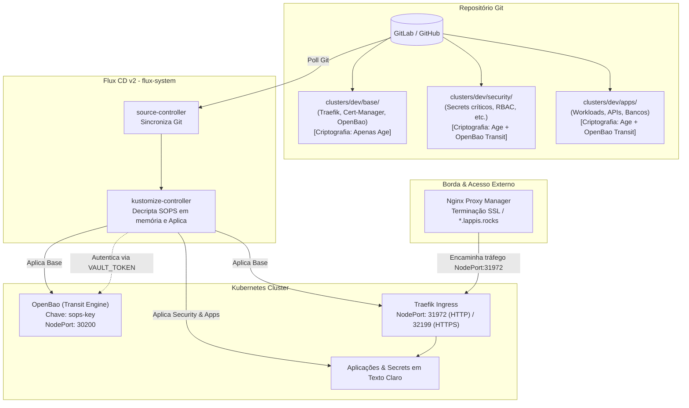
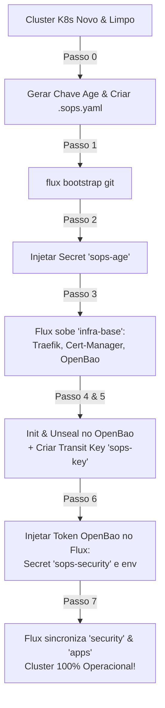

# Cluster — GitOps Architecture

Este repositório contém a infraestrutura e configuração do cluster Kubernetes gerenciado via **GitOps (Flux CD v2)**, com controle de ingress através do **Traefik**, gerenciamento centralizado de chaves com **OpenBao (Transit Secrets Engine)** e criptografia declarativa no Git com **SOPS + Age + OpenBao TKs**.

---

## 1. Arquitetura Geral



---

## 2. Estrutura de Diretórios

```text
.
├── README.md
└── clusters/
    └── dev/
        ├── .sops.yaml              # Regras de encriptação SOPS (Age vs OpenBao)
        ├── flux-system/            # Camada de controle do Flux CD
        │   ├── gotk-components.yaml# Manifestos dos controladores Flux
        │   ├── gotk-sync.yaml      # Sincronização raiz do repositório
        │   ├── infra-base.yaml     # Kustomization para o 'base/' (Age)
        │   ├── infra-sec.yaml      # Kustomization para o 'security/' (Age + OpenBao)
        │   └── kustomization.yaml  # Orquestração do flux-system
        ├── base/                   # Camada de infraestrutura fundamental (Bootstrap)
        │   ├── kustomization.yaml
        │   ├── traefik/            # Ingress Controller (CRDs, HelmRelease, IngressRoute)
        │   ├── cert-manager/       # Emissor de certificados
        │   └── openbao/            # Vault / Transit Secrets Engine
        └── security/               # Camada de segurança e segredos protegidos
            ├── kustomization.yaml
            └── secret1.yaml        # Exemplo de segredo multi-chave
```

---

## 3. Estratégia de Secrets (SOPS + Age + OpenBao Transit)

Adotamos o padrão **Multi-Party Encryption (Shamir Secret Sharing com Threshold 2)** para garantir que os segredos fiquem versionados com segurança máxima no Git:

| Camada | Regra `.sops.yaml` | Chaves Necessárias | Propósito |
| :--- | :--- | :--- | :--- |
| **`base/`** | `base/.*\.yaml` | **Apenas Age** | Resolver o problema do bootstrap ("galinha e o ovo") para subir Traefik e OpenBao. |
| **`security/` & `apps/`** | `(security\|apps)/.*\.yaml` | **Age + OpenBao Transit Key** (`shamir_threshold: 2`) | Exigir autorização centralizada do OpenBao em tempo real + chave Age para qualquer secret de aplicação. |

### Como o Flux decripta os segredos:
1. O segredo `sops-security` no namespace `flux-system` contém:
   * `age.agekey`: Chave privada do Age. (apenas no secret sops-age)
   * `VAULT_ADDR`: Endereço do OpenBao.
   * `VAULT_TOKEN`: Token de autenticação com política para `transit/decrypt/sops-key`.
2. As variáveis de ambiente `VAULT_ADDR` e `VAULT_TOKEN` são carregadas no `kustomize-controller`.
3. Ao sincronizar o Git, o Flux decripta os manifestos `.yaml` em memória e aplica os recursos normais no cluster.

---

## 4. Arquitetura de Ingress & Roteamento

Como o cluster opera em ambiente de desenvolvimento atrás de um **Nginx Proxy Manager (NPM)** externo:

1. **NPM (Temporário para poc):**
   * Recebe o tráfego da internet (ex: `traefik.lappis.rocks`, `openbao.lappis.rocks`, `app.lappis.rocks`).
   * Cuida da terminação SSL (certificados Let's Encrypt públicos).
   * Encaminha as requisições via HTTP para o IP do nó do cluster na porta NodePort do Traefik (**`31972`**).
2. **Traefik (Cluster Ingress):**
   * Escuta nos entryPoints `web` (80) e `websecure` (443).
   * Roteia para os pods internos baseado em objetos `IngressRoute` ou `Ingress` padrão.

---

## 5. Guia de Operação no Dia a Dia

### A. Como Criar e Criptografar um Novo Secret

1. Configure o ambiente no seu terminal:
   ```bash
   export VAULT_ADDR="http://<IP_DO_NO>:30200"
   vault login
   ```

2. Crie o arquivo YAML com o Secret em texto claro (ex: `clusters/dev/apps/meu-app/secret.yaml`):
   ```yaml
   apiVersion: v1
   kind: Secret
   metadata:
     name: meu-app-secret
     namespace: default
   type: Opaque
   stringData:
     DB_PASSWORD: "minha-senha-super-secreta"
   ```

3. Criptografe o arquivo:
   ```bash
   sops --encrypt --in-place clusters/dev/apps/meu-app/secret.yaml
   ```

4. Adicione o arquivo no `kustomization.yaml` da pasta correspondente, comite e dê push:
   ```bash
   git add clusters/
   git commit -m "feat(secret): add encrypted secret for meu-app"
   git push origin main
   ```

---

### B. Como Editar um Secret Existente

Para alterar valores de um segredo já criptografado no repositório:

```bash
# Abre o secret no seu $EDITOR, decripta temporariamente e re-criptografa ao salvar
sops clusters/dev/security/secret1.yaml
```

---

### C. Como Forçar a Sincronização do Flux

```bash
# Sincronizar repositório Git e infraestrutura base
flux reconcile kustomization flux-system --with-source
flux reconcile kustomization infra-base --with-source

# Sincronizar camada de segurança
flux reconcile kustomization security --with-source
```

---

## 6. Como Expandir o Cluster

### Adicionando uma Nova Camada (ex: `apps/`)

1. **Crie a pasta da camada:**
   ```bash
   mkdir -p clusters/dev/apps
   ```

2. **Crie o Kustomization de orquestração em `clusters/dev/flux-system/infra-apps.yaml`:**
   ```yaml
   apiVersion: kustomize.toolkit.fluxcd.io/v1
   kind: Kustomization
   metadata:
     name: apps
     namespace: flux-system
   spec:
     interval: 10m
     path: ./clusters/dev/apps
     prune: true
     dependsOn:
       - name: security
     sourceRef:
       kind: GitRepository
       name: flux-system
     decryption:
       provider: sops
       secretRef:
         name: sops-security
   ```

3. **Declare o novo manifesto em [`clusters/dev/flux-system/kustomization.yaml`](file:///home/dexmachina/projetos/Ch-aOS/chaos-cluster/clusters/dev/flux-system/kustomization.yaml):**
   ```yaml
   resources:
     - gotk-components.yaml
     - gotk-sync.yaml
     - infra-base.yaml
     - infra-sec.yaml
     - infra-apps.yaml # <- Adicione aqui
   ```

### Adicionando um Novo Ambiente (ex: `clusters/staging/` ou `clusters/prod/`)

1. Duplique a pasta `clusters/dev` para `clusters/prod`.
2. Ajuste o `.sops.yaml` para as chaves Age/Vault correspondentes ao ambiente de produção.
3. Configure uma nova instância do Flux apontando para `./clusters/prod/flux-system`.

---

## 7. Guia de Bootstrap do Cluster (Do Zero)

Caso precise subir um cluster novo ou recriar o ambiente do zero:



### Passo 0: Gerar a Chave Age e Criar o `.sops.yaml`
Antes de tudo, você precisa ter uma chave Age gerada na sua máquina e configurar o arquivo `.sops.yaml`:

1. **Gerar o par de chaves Age:**
   ```bash
   mkdir -p ~/.config/sops/age
   age-keygen -o ~/.config/sops/age/keys.txt

   age-keygen -y ~/.config/sops/age/keys.txt
   ```

2. **Criar o arquivo `clusters/dev/.sops.yaml`:**
   ```yaml
   creation_rules:
   # 1. Bootstrap / Base (Apenas Age)
   - path_regex: base/.*\.ya?ml
     encrypted_regex: ^(data|stringData)$
     key_groups:
     - age:
       - "<SUA_CHAVE_PUBLICA_AGE>"

   # 2. Segurança e Aplicações (Age + OpenBao Transit)
   - path_regex: (security|apps)/.*\.ya?ml
     encrypted_regex: ^(data|stringData)$
     shamir_threshold: 2
     key_groups:
     - age:
       - "<SUA_CHAVE_PUBLICA_AGE>"
     - hc_vault:
       - "http://<IP_DO_SEU_NO>:30200/v1/transit/keys/sops-key"
   ```

### Passo 1: Instalar o Flux CD no Cluster
Conecte o cluster ao repositório Git:
```bash
flux bootstrap git \
  --url=ssh://git@git:SEU/CLUSTER.git \
  --branch=main \
  --path=clusters/dev/flux-system
```

### Passo 2: Injetar a Chave Age Inicial (Bootstrap Secret)
O Flux precisa da chave Age para decriptar a camada `base/` (onde estão senhas do Traefik):
```bash
cat ~/.config/sops/keys.txt | kubectl create secret generic sops-age \
  -n flux-system \
  --from-file=age.agekey=/dev/stdin
```

### Passo 3: Deixar o Flux subir a Camada Base (`infra-base`)
O Flux vai reconciliar e subir o **Traefik**, **Cert-Manager** e **OpenBao**:
```bash
flux reconcile kustomization infra-base --with-source

# Aguarde o pod do OpenBao e do Traefik ficarem 'Running'
kubectl get pods -n openbao -w
```

### Passo 4: Inicializar e Destravar (Unseal) o OpenBao
Entre no container do OpenBao para inicializar o cofre:
```bash
kubectl exec -it openbao-0 -n openbao -- sh

# 1. Inicializar (GUARDE AS 5 UNSEAL KEYS E O ROOT TOKEN!)
bao operator init

# 2. Destravar o cofre (use 3 chaves diferentes)
bao operator unseal <UNSEAL_KEY_1>
bao operator unseal <UNSEAL_KEY_2>
bao operator unseal <UNSEAL_KEY_3>

# 3. Fazer login com o Root Token
bao login <INITIAL_ROOT_TOKEN>

# aproveite para copiar essas chaves e o token e guardar de forma encriptada em cluster/dev/base/openbao/unseal-keys.yaml
```

### Passo 5: Habilitar o Transit Secrets Engine no OpenBao
Ainda dentro do container do OpenBao:
```bash
# 1. Ativar o motor Transit
bao secrets enable transit

# 2. Criar a chave para o SOPS
bao write -f transit/keys/sops-key

# 3. Criar a política de permissões
bao policy write sops - <<EOF
path "transit/encrypt/*" { capabilities = [ "update" ] }
path "transit/decrypt/*" { capabilities = [ "update" ] }
path "transit/keys/*" { capabilities = [ "read" ] }
EOF

# 4. Gerar o token de longa duração para o Flux/SOPS
bao token create -policy="sops" -period="8760h"

# 5. Sair do container
exit
```

### Passo 6: Injetar as Credenciais do OpenBao no Flux
Forneça ao `kustomize-controller` o token do OpenBao para decriptar `security/` e `apps/`:

```bash
# 1. Criar o secret sops-security
kubectl create secret generic sops-security \
  -n flux-system \
  --from-file=age.agekey=~/.config/sops/age/keys.txt \
  --from-literal=VAULT_TOKEN="<TOKEN_DO_PASSO_5>" \
  --from-literal=VAULT_ADDR="http://<IP_DO_NO>:30200"

# 2. Injetar as variáveis de ambiente no controller
kubectl set env deployment/kustomize-controller -n flux-system \
  VAULT_ADDR="http://<IP_DO_NO>:30200" \
  VAULT_TOKEN="<TOKEN_DO_PASSO_5>"
```

### Passo 7: Sincronizar Tudo
```bash
flux reconcile kustomization security --with-source
```

