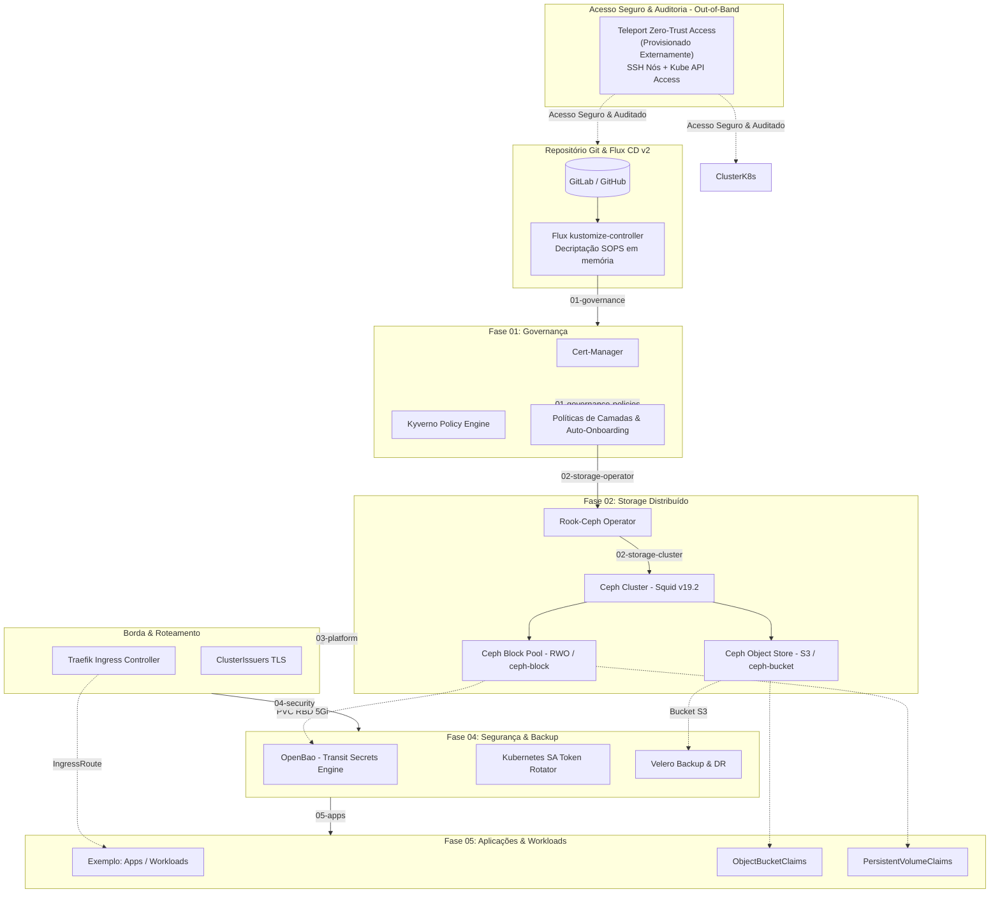
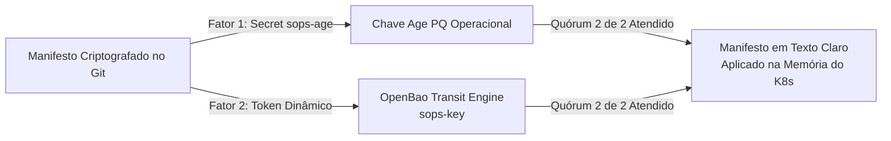

# Ch-aOS Cluster — Enterprise GitOps & Cloud-Native Architecture

Este repositório contém a infraestrutura como código (IaC) e a configuração declarativa do cluster Kubernetes gerenciado via **GitOps (Flux CD v2)**. 
---

## 1. Visão Geral da Arquitetura

O ecossistema opera em um pipeline estritamente ordenado por fases de dependência (`01` a `05`), garantindo que serviços fundamentais de governança e armazenamento estejam prontos antes de serviços de plataforma, segurança e aplicações.



---

## 2. As 5 Fases do Pipeline GitOps

| Fase | Kustomization Flux | Caminho | Componentes | Responsabilidade |
| :--- | :--- | :--- | :--- | :--- |
| **01** | `01-governance`<br>`01-governance-policies` | `clusters/dev/base/platform/governance` | **Cert-Manager**, **Kyverno** | Emissão de certificados, validação de regras semânticas de camadas, criação automática de NetworkPolicies e ResourceQuotas ao criar namespaces. |
| **02** | `02-storage-operator`<br>`02-storage-cluster` | `clusters/dev/base/storage/rook-ceph-*` | **Rook-Ceph** (Squid v19.2.0) | Armazenamento distribuído unificado: CSI Block (`ceph-block`) para bancos/PVCs e Object Store S3 (`ceph-bucket` via OBC). |
| **03** | `03-platform` | `clusters/dev/base/platform/traefik` | **Traefik Proxy**, ClusterIssuers | Ingress Controller, roteamento HTTP/HTTPS L7 via `IngressRoute`, terminação TLS e integração com borda. |
| **04** | `04-security` | `clusters/dev/base/security` | **OpenBao**, **Velero** | Cofre com Transit Engine para descriptografia SOPS, renovador dinâmico de tokens via SA e backup/restore do cluster para bucket Ceph S3. |
| **05** | `05-apps` | `clusters/dev/apps` | Templates e Workloads | Aplicações de negócio com segregação de rede automática, PVCs em Ceph Block e buckets S3 dedicados via OBC. |

---

## 3. Requisitos de Hardware e Dependências de Sistema

### A. Requisitos de Hardware

#### 1. Ambiente de Desenvolvimento / Lab (Single-Node ou Compacto)
* **CPU:** Mínimo 4 vCPUs (Recomendado: 8 vCPUs).
* **Memória RAM:** Mínimo 8 GB (Recomendado: 16 GB).
* **Armazenamento:**
  * 1 disco para o Sistema Operacional / K8s (`/dev/sda` ou `/`).
  * 1 disco ou partição bruta dedicada sem formatação (Raw Block Device, ex: `/dev/sdb`, `/dev/nvme0n1` ou diretório) para os OSDs do Ceph (mínimo 50 GB).

#### 2. Ambiente de Produção / Bare-Metal Enterprise (Multi-Node HA - Ex: Huawei / On-Premise)
* **Topologia:** Mínimo de 3 nós Control-Plane/Worker/Etcd (para quórum de Ceph MON e réplica tripla de dados).
* **CPU por Nó Worker:** 8 a 16+ Cores.
* **Memória RAM por Nó Worker:** Mínimo 32 GB (Recomendado: 64 GB+).
* **Armazenamento por Nó:**
  * 1x Discos em RAID 1 para SO (Linux).
  * 1x Disco externo NVMe / SSD / HDD para OSDs do Ceph.

---

### B. Dependências de Sistema Operacional e Kernel

* **Sistema Operacional:** Debian 12 ou 13.
* **Kernel:** Linux Kernel 5.15+ (Recomendado 6.x).
* **Container Runtime:** `containerd` (v1.7+) ou `CRI-O` com systemd cgroup driver.
* **Kubernetes RKE2:** Versão `v1.35.x>=`.

---

## 4. Estrutura do Repositório

```text
.
├── README.md
└── clusters/
    └── dev/
        ├── .sops.yaml                        # Regras de encriptação SOPS (Age vs OpenBao)
        ├── flux-system/                      # Orquestração mestre do Flux CD (5 Fases)
        │   ├── gotk-components.yaml          # Controladores do Flux
        │   ├── gotk-sync.yaml                # Sincronização do repositório Git
        │   ├── 01-governance.yaml            # Fase 1: Cert-Manager & Kyverno
        │   ├── 01-governance-policies.yaml   # Fase 1: Políticas de Camadas
        │   ├── 02-storage-operator.yaml      # Fase 2: Rook-Ceph Operator
        │   ├── 02-storage-cluster.yaml       # Fase 2: Ceph Cluster, Block & S3 Pools
        │   ├── 03-platform.yaml              # Fase 3: Traefik Ingress & TLS
        │   ├── 04-security.yaml              # Fase 4: OpenBao & Velero
        │   ├── 05-apps.yaml                  # Fase 5: Workloads e Aplicações
        │   └── kustomization.yaml
        ├── base/
        │   ├── platform/
        │   │   ├── governance/               # Cert-Manager, Kyverno & Policies
        │   │   └── traefik/                  # Traefik Controller & IngressRoutes
        │   ├── storage/
        │   │   ├── rook-ceph-operator/       # HelmRelease do Rook Operator
        │   │   └── rook-ceph-cluster/        # CephCluster CR, StorageClasses & OBC
        │   └── security/
        │       ├── openbao/                  # OpenBao Transit, SA Auth & Rotator
        │       └── velero/                   # Velero DR com backend Ceph RGW S3
        └── apps/                             # Templates de Aplicações
            └── example-app/                  # App demonstrativo com OBC e Traefik
```

---

## 5. Como o Sistema Funciona em Detalhes

### A. Governança e Isolamento com Kyverno
1. **Semantic Layers Enforcement:** Impede que pods de camadas públicas/base se comuniquem diretamente com bancos ou secrets de aplicações sem passar pelas camadas autorizadas.
2. **Auto Namespace Onboarding:** Ao criar qualquer novo namespace, o Kyverno injeta automaticamente:
   * `NetworkPolicy` com isolamento padrão (`default-isolation`).
   * `ResourceQuota` com limites padrão de CPU e Memória para evitar starvation do nó.

### B. Storage Unificado com Rook-Ceph
* **Block Storage (`ceph-block`):** RWO provisionado via RBD. Utilizado pelo OpenBao e bancos de dados.
* **Object Storage S3 (`ceph-bucket`):** Criação de buckets e credenciais declarativas via `ObjectBucketClaim` (OBC).
* O endpoint interno do S3 fica disponível no cluster em `http://rook-ceph-rgw-ceph-s3.rook-ceph.svc:80`.

### C. Segurança Zero-Trust com SOPS + Shamir Secret Sharing
Utilizamos criptografia multi-partes no Git (`shamir_threshold: 2`):



* **Chave Age (Operacional / Cluster):** Injetada no secret `sops-age` do Flux.
* **Chave Age (Break-Glass / Disaster Recovery):** Mantida offline (cold storage) para decriptação de emergência sem o OpenBao.
* **OpenBao Transit Engine:** O `kustomize-controller` do Flux obtém tokens de curta duração via ServiceAccount Kubernetes para decriptar os manifestos durante o reconciliamento.

### D. Backup e Disaster Recovery com Velero
* **Engine:** Velero integrado ao plugin AWS S3 (`velero-plugin-for-aws`).
* **Destino:** Bucket S3 provisionado dinamicamente pelo Rook-Ceph (`velero-backups`).
* **Snapshots CSI:** Habilitado via `features: EnableCSI` para tirar snapshots de volumes RBD Ceph.
* **Rotina:** Backup diário automático às 03:00 AM com retenção configurável de 30 dias.

### E. Acesso Seguro, Identidade e Auditoria com Teleport (Out-of-Band)
* **Zero-Trust Access:** O Teleport gerencia o acesso centralizado e auditado para sessões SSH nos nós bare-metal e conexões autenticadas à API do Kubernetes e via HTTPS, tirando a dependência de VPNs para gerenciar o cluster (`tsh login`, `tsh kube login`).
* **Arquitetura Out-of-Band (Externo ao Cluster):**
  * O plano de controle do Teleport (*Auth & Proxy Service*) é provisionado **fora do cluster Kubernetes** (em infraestrutura/VM isolada ou serviço gerenciado dedicado).
  * **Decisão de Resiliência:** Manter o Teleport desacoplado do ciclo de vida do cluster garante acesso *Break-Glass*. Mesmo em caso de pane catastrófica no Kubernetes, falhas de CNI ou indisponibilidade do Traefik, os operadores e mantenedores conseguem acessar com segurança os nós bare-metal para diagnóstico e restauração.
  * **Conexão com o Cluster:** O cluster se comunica com o Teleport via agente reverso (`teleport-kube-agent` / kubeconfig) em conexão puramente de saída (*outbound-only*), eliminando a necessidade de expor portas de gerenciamento ou túneis SSH tradicionais para a internet.

---

## 6. Guia Operacional do Dia a Dia

### Como criar e criptografar um novo Secret
1. Configure seu terminal:
   ```bash
   export VAULT_ADDR="http://<IP_DO_CLUSTER>:30200"
   vault login
   ```

2. Crie o arquivo do segredo (ex: `clusters/dev/apps/meu-app/secret.yaml`) e criptografe:
   ```bash
   sops --config clusters/dev/.sops.yaml encrypt --in-place clusters/dev/apps/meu-app/secret.yaml
   ```

3. Comite no Git e sincronize com o Flux:
   ```bash
   git add clusters/dev/apps/
   git commit -m "feat: add secure secret"
   git push origin main
   flux reconcile kustomization 05-apps --with-source
   ```

### Como disparar um backup manual com Velero
```bash
# 1. Criar backup de um namespace específico
velero backup create backup-manual-app --include-namespaces=example-app --wait

# 2. Inspecionar o status do backup
velero backup describe backup-manual-app

# 3. Listar backups disponíveis no Ceph S3
velero backup get
```

### Como verificar a saúde do Storage Ceph
```bash
kubectl get cephcluster -n rook-ceph
kubectl get cephblockpool,cephobjectstore -n rook-ceph
kubectl get obc -A
```

---

## 7. Procedimento de Bootstrap (Do Zero)

Caso precise subir este cluster do zero em um ambiente novo:

1. **Bootstrap do Flux:**
   ```bash
   flux bootstrap git \
     --url=ssh://git@github.com/SEU-USER/chaos-cluster.git \
     --branch=main \
     --path=clusters/dev/flux-system
   ```

2. **Injetar a Chave Age do SOPS:**
   ```bash
   cat ~/.config/sops/age/keys.txt | kubectl create secret generic sops-age \
     -n flux-system \
     --from-file=age.agekey=/dev/stdin
   ```

3. **Acompanhar a orquestração automática das fases:**
   ```bash
   flux get kustomizations -w
   ```

4. **Inicializar e Destravar (Unseal) o OpenBao (após Fase 04):**
   ```bash
   kubectl exec -it openbao-0 -n openbao -- bao operator init
   # Guarde as 5 Unseal Keys e o Initial Root Token retornados!

   # Destravar o cofre (mínimo de 3 chaves - Shamir 3-of-5 padrão do operador):
   kubectl exec -it openbao-0 -n openbao -- bao operator unseal <KEY_1>
   kubectl exec -it openbao-0 -n openbao -- bao operator unseal <KEY_2>
   kubectl exec -it openbao-0 -n openbao -- bao operator unseal <KEY_3>
   ```

5. **Persistir as Chaves com Segurança no Git (`unseal-keys.yaml`):**
Para garantir rastreabilidade e permitir recuperação sem expor segredos em texto claro, salve o token e as chaves no secret `clusters/dev/base/security/openbao/unseal-keys.yaml` (isso é inseguro em ambientes de produção, mas aceitável em ambientes single cluster ou ambientes sem uma forma de fazer o auto unseal do OpenBao):

   ```yaml
   apiVersion: v1
   kind: Secret
   metadata:
     name: unseal-keys
     namespace: openbao
   type: Opaque
   stringData:
     InitialToken: "<INITIAL_ROOT_TOKEN>"
     Unseal1: "<UNSEAL_KEY_1>"
     Unseal2: "<UNSEAL_KEY_2>"
     Unseal3: "<UNSEAL_KEY_3>"
     Unseal4: "<UNSEAL_KEY_4>"
     Unseal5: "<UNSEAL_KEY_5>"
   ```
   Criptografe o arquivo com SOPS (utilizando a chave Age de bootstrap) e envie ao Git:
   ```bash
   sops --config clusters/dev/.sops.yaml encrypt --in-place clusters/dev/base/security/openbao/unseal-keys.yaml
   git add clusters/dev/base/security/openbao/unseal-keys.yaml
   git commit -m "chore(openbao): persist encrypted unseal keys and root token"
   git push
   ```

6. **Operação Contínua:**
   *(O CronJob de rotação de token `token-rotator` assumirá a autenticação contínua do Flux CD via Kubernetes ServiceAccount Auth).*

